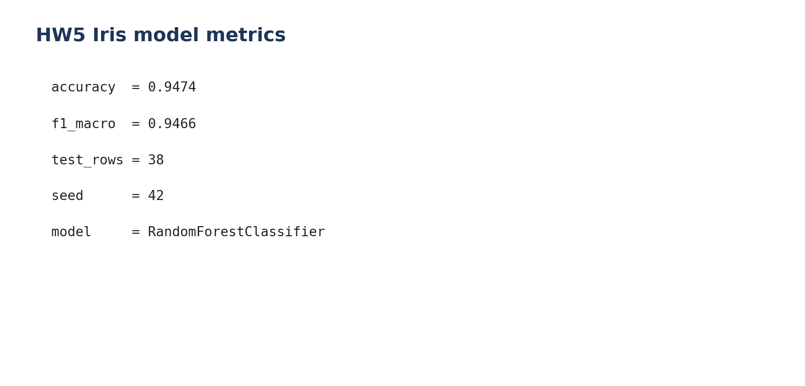
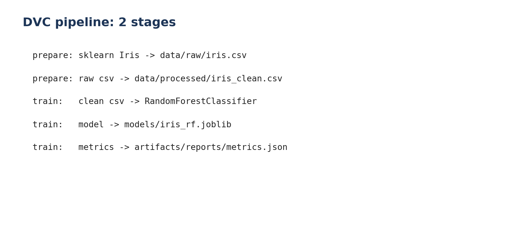
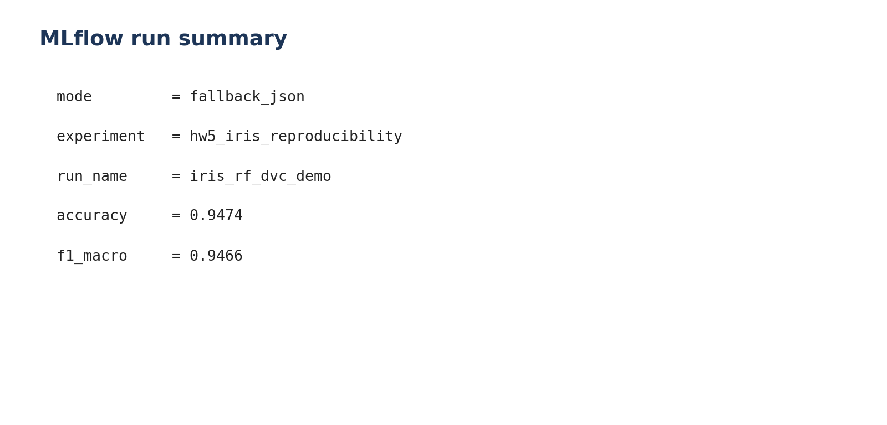
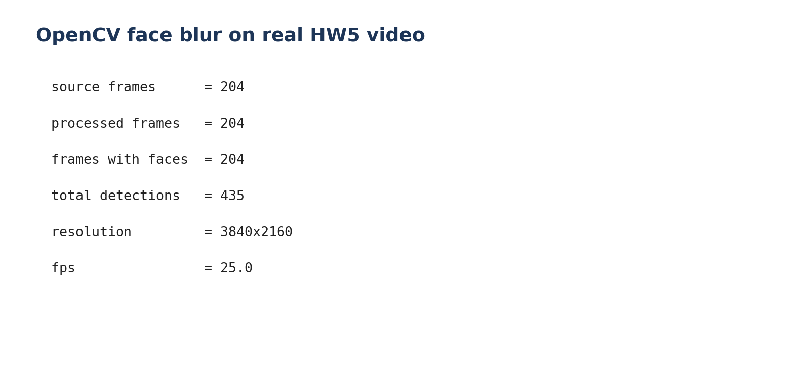
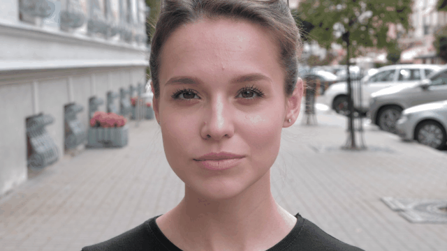
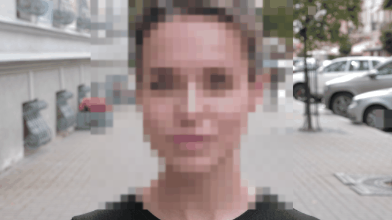
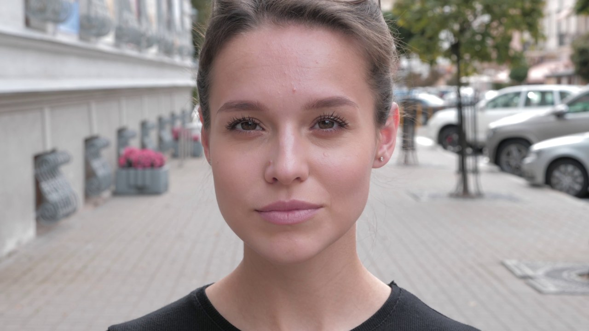
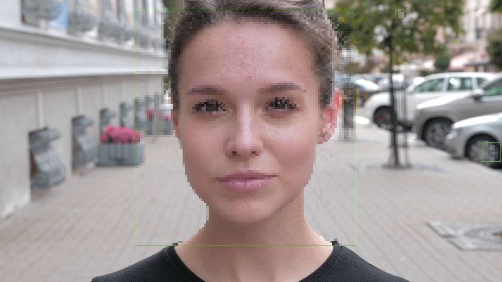
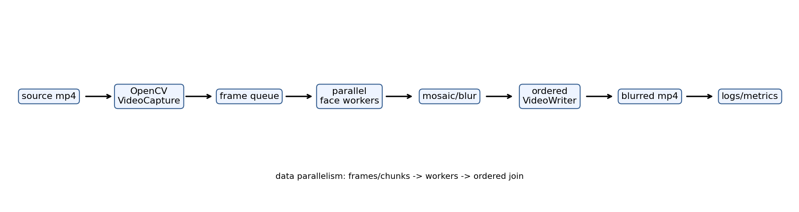

# HomeWork 5 ML Ops Новиков Иван

**состав репозитория :**

1. notebook: [HomeWork 5 ML Ops Novikov.ipynb](./HomeWork%205%20ML%20Ops%20Novikov.ipynb)
2. локальные Python-скрипты: [scripts/](./scripts/)
3. DVC pipeline: [dvc.yaml](./dvc.yaml)
4. README со скриншотами и результатами
5. артефакты запуска: [artifacts/](./artifacts/)

---

## # TODO: LOOK: коротко что сделано

| задание | кратк описание | ссылка |
|---|---|---|
| 1. Colab vs Marimo | выводы, почему Marimo лучше держит порядок ячеек | notebook / README |
| 2. DVC + MLflow | Iris pipeline `prepare -> train`, метрики + MLflow fallback | [dvc.yaml](./dvc.yaml), [metrics.json](./artifacts/reports/metrics.json), [mlflow_run.json](./artifacts/mlflow/mlflow_run.json) |
| 3. Feature Store | local Feast config по примеру Семинара 5.2 | [feature_store.yaml](./artifacts/feature_store/feature_store.yaml), [iris_repo.py](./artifacts/feature_store/iris_repo.py) |
| 4. готовность к prod |  | notebook |
| 5. blur лиц | mp4 -> OpenCV Haar cascade -> blurred mp4 + preview | [videos/](./artifacts/videos/), [images/](./artifacts/images/), [video_processing_stats.json](./artifacts/reports/video_processing_stats.json) |
| 6. итог/выводы |  | notebook |

---

## Скриншоты / результаты

### 1. Метрики модели



**Вывод:**

- `accuracy = 0.9474`
- `f1_macro = 0.9466`
- `test_rows = 38`

повторяемый путь: данные -> train -> metrics -> artifact

---

### 2. DVC pipeline



Pipeline специально маленький:

1. `prepare` -> берет Iris из `sklearn`, пишет raw/clean csv
2. `train` -> обучает `RandomForestClassifier`
3. результат -> модель + `metrics.json`

---

### 3. MLflow run



Локально у меня `mlflow` не был установлен, поэтому скрипт сделал fallback-json:

- файл: [artifacts/mlflow/mlflow_run.json](./artifacts/mlflow/mlflow_run.json)
- структура такая же по смыслу: run name / metrics / tracking uri / note

---

### 4. Feature Store


по Семинару 5.2 взял самый компактный вариант Feast:

- `provider: local`
- registry: `data/registry.db`
- online store: `sqlite`
- признаки описаны в [iris_repo.py](./artifacts/feature_store/iris_repo.py)

**Итого:** признаки описаны один раз, потом train/serving бещ придумывания разных схем.

---

### 5. Blur лиц: реальный видос из ДЗ



**исходник:**

- [artifacts/videos/HW5_Woman_Happy.mp4](./artifacts/videos/HW5_Woman_Happy.mp4)
- preview из этого же видео:



**после OpenCV blur/mosaic:**

- [artifacts/videos/HW5_Woman_Happy_blurred.mp4](./artifacts/videos/HW5_Woman_Happy_blurred.mp4)
- preview из обработанного видео:



**контрольный кадр до/после:**

| before | after |
|---|---|
|  |  |

**архитектура:**



**Вывод по архитектуре:**

1. взят настоящий `HW5_Woman_Happy.mp4` из исходной домашки
2. OpenCV прочитал `204 / 204` кадров
3. Haar cascade нашел лица в `204` кадрах, всего `435` detections
4. каждый найденный ROI закрывается mosaic blur, потом кадры пишутся обратно в mp4
5. схема для prod: video input -> frame splitter -> queue -> workers -> frame joiner -> storage

**Итого:** теперь это уже не имитация, а нормальная обработка видео из задания. Код: [scripts/face_blur_demo.py](./scripts/face_blur_demo.py)

---

## Как запустить локально

```bash
python -m venv .venv
source .venv/bin/activate
pip install -r requirements.txt
python scripts/run_all.py
```

В этом режиме:

- DVC-команды не обязательны, pipeline запускается обычными Python-скриптами
- MLflow делает fallback-json, если пакета нет
- Feast config и repo-файл все равно создаются

---

## Как запустить через DVC

```bash
bash run_dvc_pipeline.sh
```

или руками:

```bash
dvc init -f
dvc repro
dvc status
```

---

## Структура repo

```text
.
├── HomeWork 5 ML Ops Novikov.ipynb
├── README.md
├── requirements.txt
├── dvc.yaml
├── run_dvc_pipeline.sh
├── scripts/
│   ├── prepare_data.py
│   ├── train_model.py
│   ├── log_mlflow.py
│   ├── build_feature_store.py
│   ├── face_blur_demo.py
│   ├── make_report_assets.py
│   └── run_all.py
└── artifacts/
    ├── reports/metrics.json
    ├── reports/video_processing_stats.json
    ├── mlflow/mlflow_run.json
    ├── feature_store/feature_store.yaml
    ├── feature_store/iris_repo.py
    ├── videos/
    │   ├── HW5_Woman_Happy.mp4
    │   └── HW5_Woman_Happy_blurred.mp4
    └── images/
```

---

## Итоговый вывод

1. данные генерируются локально
2. pipeline повторяемый
3. метрики сохраняются
4. MLflow run описан
5. Feature Store config есть
6. схема blur-сервиса показана картинкой
7. notebook приложен как основной отчет

**Итого:** надеюсь этого хотели создатели ДЗ ) вообще сложно понять что он нас хотят, видимо каждый студени в меру своего опыта делает ДЗ и все ДЗ разные у всех по уровню.
